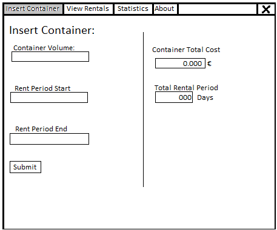
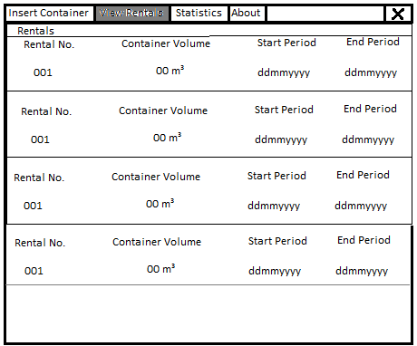
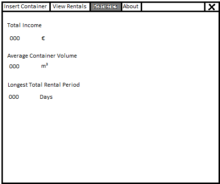
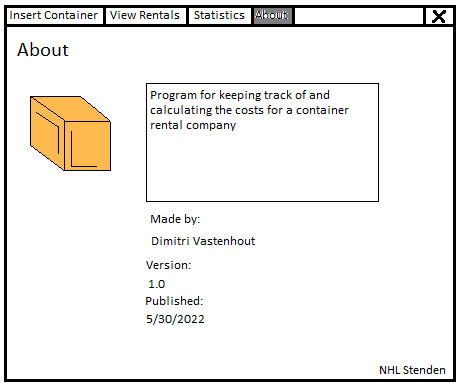
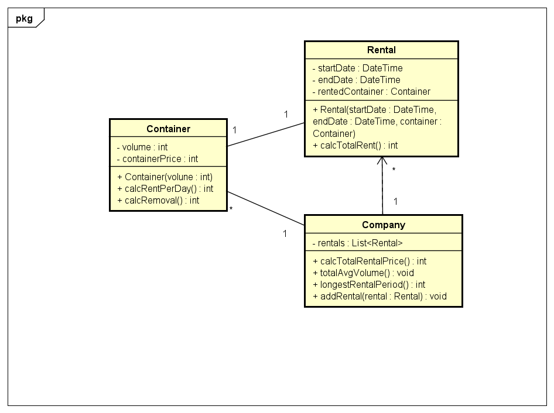

# Startdocument for Container Rentals

Startdocument of **Dimitri Vastenhout**. Student number **4983750**.

## Problem Description

A container company rents containers there is 40 € rent per day per m3 at the end of the period the containers need to be taken away which cost 60 € if the volume of the container is less than or equal to 2 m3, else it will cost 125 €.
The user must only have to input for each container:
•	The volume in form of a positive double
•	The start date as a string and written in the form of ddmmyyyy
•	The end date as a string in the form of ddmmyyyy
For how many containers they want to rent. The program will have to output:
•	The total cost of the containers for the rented period
•	The total income of all the rented containers
•	The average volume of containers rented
•	The longest rental period

## GUI

### Input & Output

#### Input

|Case|Type|
|----|----|
|volume | `integer`|
|startDate | `ddmmyyyy -string`|
|endDate | `ddmmyyyy -string`|

#### Output

|Case|Type|
|----|----|
|Cost of Container for rental period|`integer`|
|Total income of all rented containers|`integer`|
|Average volume of rented containers|`double`|
|The longest rental period|`ddmmyyyy -string`|

#### Remarks

* Input will be checked.
* negatives will automatically be turned to positives
* Incorrect dates will be converted to closest values in terms of numbers

## Class Diagram

## Testplan

### Test Data

#### Containers

| Container Name | Volume | Code |
| -------------- | ------ | ---- |
| `container1` | 15 | `Container container1 = new Container(15)` |
| `container2` | 20 | `Container container2 = new Container(20)` |
| `container3` | 70 | `Container container3 = new Container(70)` |
| `container4` | -63 | `Container container4 = new Container(-63)` |

#### Rental

| Rental Name | Start Date | End Date | Container| Code |
| ----------- | ---------- | -------- | -------- | ---- |
| `rental1` | `12132022` | `25122022` | `container1` | `Rental rental1 = new Rental("12132022", "250122022", container1)`|
| `rental2` | `06062022` | `30062022` | `container2` | `Rental rental2 = new Rental("06062022", "30062022", container2)`|
| `rental3` | `18072021` | `20082021` | `container3` | `Rental rental3 = new Rental("18072021", "20082021", container3)`|
| `rental4` | `19102022` | `32122022` | `container4` | `Rental rental4 = new Rental("19102022", "32122022", container4)`|

#### Company

| Company Name | Rental List | Code |
| ------------ | ------- | ----- |
| `Company` | `rental` | `List<Rental> rental = new List<Rental>()` |

### Test Cases & Calculations

#### #1 Calculate Date

The Dates should be calculated by dismantling the string with substring and filling it into a dateTime variable

|Rental|Action|Expected output|
|---|-----------|----|
| rental1 | `conversion in Constructor` | `12/12/2022 12:00:00 AM` for startDate & `12/25/2022 12:00:00 AM` for endDate |
| rental2 | `conversion in Constructor` | `6/6/2022 12:00:00 AM` for startDate & `6/30/2022 12:00:00 AM` for endDate |
| rental3 | `conversion in Constructor` | `7/18/2021 12:00:00 AM` for startDate & `8/20/2021 12:00:00 AM` for endDate |
| rental4 | `conversion in Constructor` | `10/19/2022 12:00:00 AM` for startDate & `12/31/2022 12:00:00 AM` for endDate |

#### #2 Calculate rent per day

calculate the rent for a rental based on the containers removal cost and cost per day based on the days between the start and end date

|Rental|Action|Expected output|
|----|------|---------------|
| rental1 | `calcTotalRent()` | 645 |
| rental2 | `calcTotalRent()` | 1085 |
| rental3 | `calcTotalRent()` | 1445 |
| rental4 | `calcTotalRent()` | 3045 |

#### #3 Calculate Total Rental Income

Calculates the income from all rentals in the rentals list

|Action|Expected output|
|------|---------------|
|`calcTotalRental()`| 6220 |

#### #4 Calculate average volume

Calculates the average volume by taking all the volumes from the rental list and dividing it by the size of the list with list.count

 | Action | Expected output |
 | ------ | --------------- |
 | `totalAvgVolume` | 42 |

#### #5 Calculate Longest Rental Period

Taking the startTime and endTime and comparing them between eachother to find the days in between and comparing all of the days in between from the rentals list to find the highest value

 | Action | Expected output |
 | ------ | --------------- |
 | `longestRentalPeriod()` | 73 days |